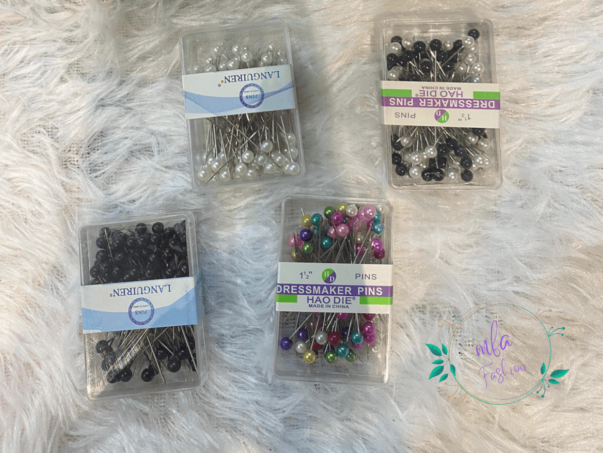

# page

# <article class="item thumb span-1"> Change Span Number "1,2,3" to change the border of the image on the page

	<!-- Items -->
		

			<article class="item thumb span-1"><h2>#</h2></article>
			<article class="item thumb span-1"><h2>#</h2></article>
			<article class="item thumb span-3"><h2>#</h2></article>
			<article class="item thumb span-1"><h2>#</h2></article>
			<article class="item thumb span-2"><h2>#</h2></article>
			<article class="item thumb span-3"><h2>#</h2></article>
			<article class="item thumb span-1"><h2>#.</h2></article>
			<article class="item thumb span-2"><h2>#</h2></article>
			<article class="item thumb span-1"><h2>#</h2></article>
    

